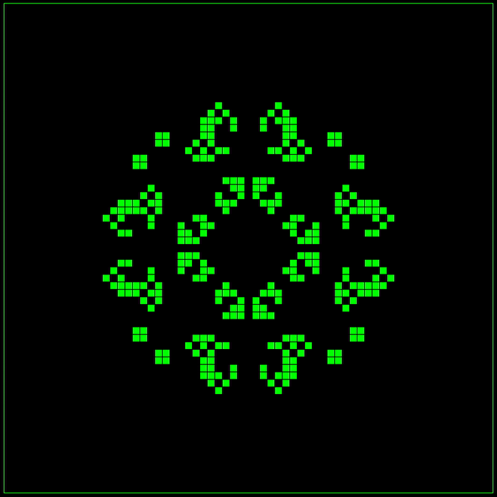
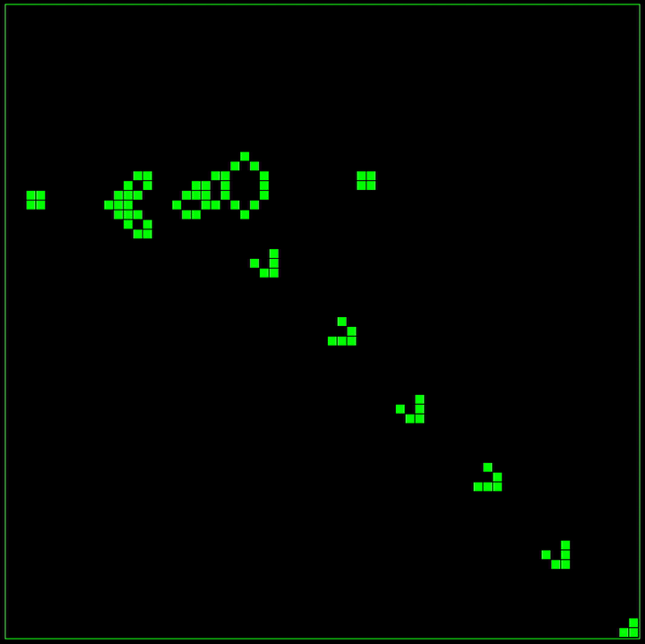

# Conway's Game of Life Simulator

<div align="center">
    <p>
        
        
        
        </p>

The Game of Life is a cellular automaton initially created by John Conway in the 1970s. It is composed of a grid 
of cells which can be in either one of two possible states: alive (occupied) or dead (unoccupied). The game state 
evolves over time based entirely on its initial state (given no additional input) according to a simple set of 
rules that govern cell occupancy. It is a fascinating demonstration of how complexity and self-organisation 
can emerge, spontaneously, from a set of deterministic laws, drawing parallels to how the first forms of life 
and self-replication may have emerged from inorganic chemical reactions.
</div>

## Rules
The occupancy of any given cell in the next generation is determined by the current occupancy of the eight 
neighbour cells surrounding it. The rules are as follows:

1. A live cell with either two or three live neighbours remains alive into the next generation
2. A live cell with fewer than two or greater than three live neighbours dies
3. A dead cell with exactly three live neighbours becomes alive in the next generation

## How To Run
1. Clone the repo and navigate to its top level
```
git clone git@github.com:TomRaynes/Game-Of-Life.git
cd Game-Of-Life
```
2. Start the program
```
./GOL
```

## Usage
- `Click and Drag` to occupy and/or de-occupy cells

- `Spacebar` to start / stop the simulation

- `L` to load an existing or saved preset

- `S` to save the current game state as a preset

- `C` to clear the grid

- `R` to randomise all cell occupancies

- `Up Arrow` and `Down Arrows` to increment / decrement the simulation speed
